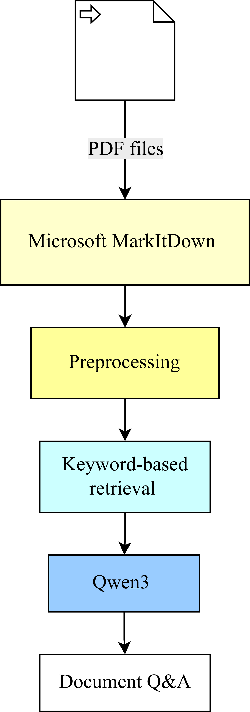
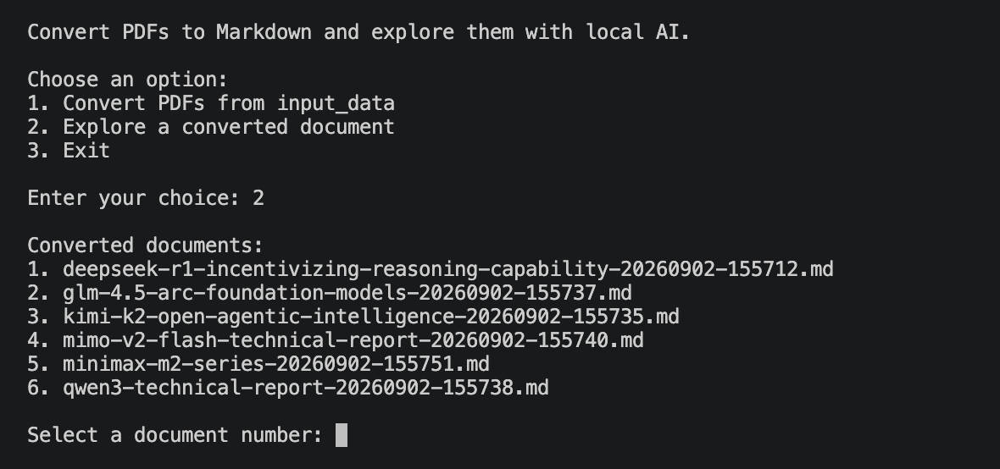
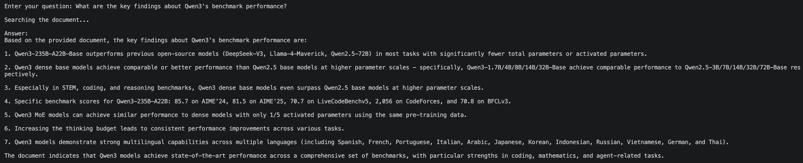

# MarkItDown PDF Pipeline

A Python pipeline that batch converts PDF documents to Markdown using Microsoft MarkItDown and lets users explore the converted content with a local Qwen model running through Ollama.

The project keeps the workflow simple and local, without using a vector database, embeddings, or external LLM APIs.

## Features

- Batch-process multiple PDFs from `input_data/`
- Convert PDFs to Markdown using Microsoft MarkItDown
- Preprocess extracted Markdown
- Generate metadata for each converted document
- Retrieve relevant document chunks using keyword matching
- Ask questions about a selected document from the terminal
- Run Qwen3 locally using Ollama


<p align="center">
  
</p>

## Project Structure

```text
MarkItDown PDF Pipeline/
├── input_data/
├── results/
│   ├── markdown/
│   └── metadata.json
├── src/
│   ├── converter.py
│   ├── metadata.py
│   ├── ollama_client.py
│   ├── preprocessor.py
│   └── retriever.py
├── tests/
├── assets/
├── main.py
├── requirements.txt
├── .gitignore
└── README.md
```

## Technologies

- Python
- Microsoft MarkItDown
- Ollama
- Qwen3

## Setup
### 1. Clone the repository

```bash
git clone <your-repository-url>
cd "MarkItDown PDF Pipeline"
```

### 2. Create and activate a virtual environment

On macOS/Linux:

```bash
python3 -m venv .venv
source .venv/bin/activate
```

### 3. Install dependencies

```bash
pip install -r requirements.txt
```

### 4. Install Ollama and Qwen3

Install Ollama, then download the model:

```bash
ollama pull qwen3:4b
```

Test the model:

```bash
ollama run qwen3:4b
```

## Usage

Place one or more PDF files inside:

```text
input_data/
```

Run the application:

```bash
python main.py
```

The CLI provides three options:

```text
Convert PDFs to Markdown and explore them with local AI.

Choose an option:
1. Convert PDFs from input_data
2. Explore a converted document
3. Exit
```

## PDF Conversion

Option `1` processes all PDF files inside `input_data/`.

Each PDF is converted into a separate Markdown file and saved under:

```text
results/markdown/
```

Metadata for the processed files is stored in:

```text
results/metadata.json
```

## Document Q&A

Option `2` lists the converted Markdown documents and allows the user to select one for Q&A.



The selected document is searched for content relevant to the user's question, and the retrieved text is passed to the local Qwen3 model.

Example:



## Retrieval
The document is split into smaller chunks. Keywords are extracted from the user's question and used to rank the chunks. The most relevant chunks are then passed to Qwen3 for answering.

This avoids sending the entire document to the model for every question.

## Preprocessing

The preprocessing step cleans the Markdown before it is used for retrieval.

It handles:
- standalone page numbers
- words split across lines with hyphens
- unnecessary whitespace
- excessive blank lines

Markdown tables are preserved during preprocessing.